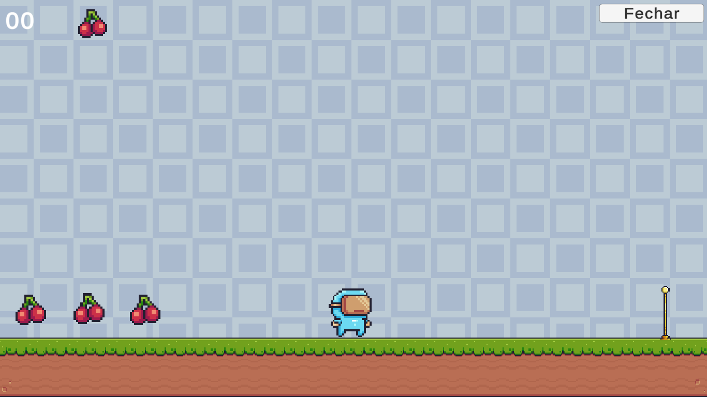
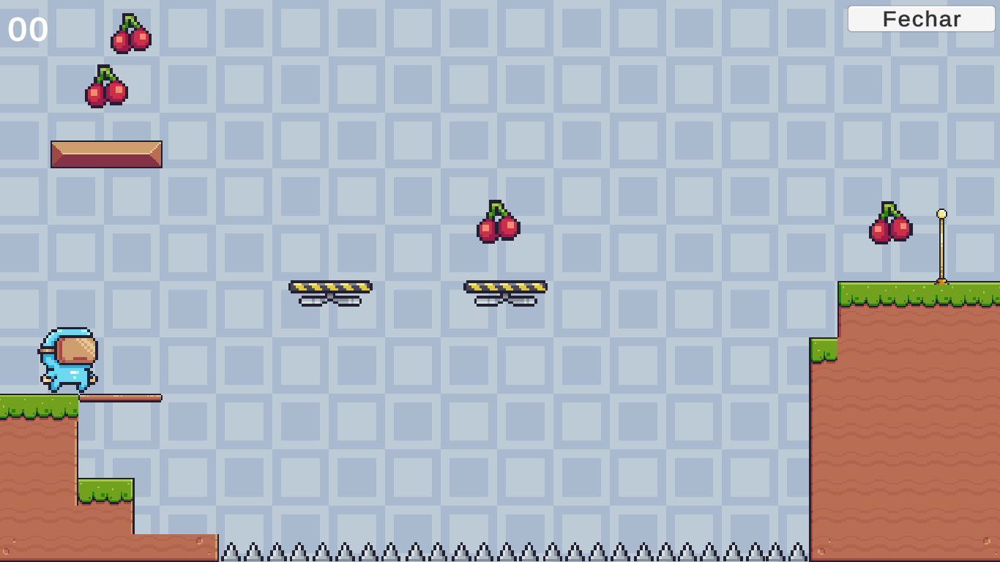
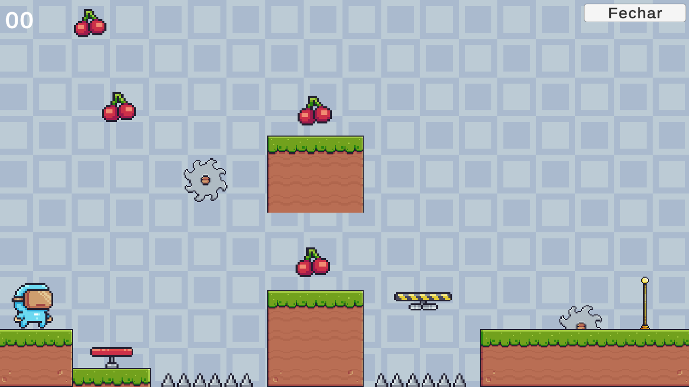

# Pixel Adventure

Jogo criado para testar meus conhecimentos em desenvolvimento de jogos, utilizando a engine da Unity, com a linguagem de programação C#.

## Descrição

O Pixel Adventure é um de plataforma desenvolvido em Unity usando C#. Criado para testar as mais diversas mecanicas presentes em um jogo de plataforma. O objetivo é basicamente coletar o máximo de frutas possíveis e chegar ao fim da fase até completar todas as fases.

## Capturas de Tela

## Como Jogar

1. **Download:** https://drive.google.com/file/d/1UsEXiKly5EcFiiFiEFmZ_ARCEbdBcFNU/view?usp=sharing

2. **Execute** o arquivo *Game project.exe*.